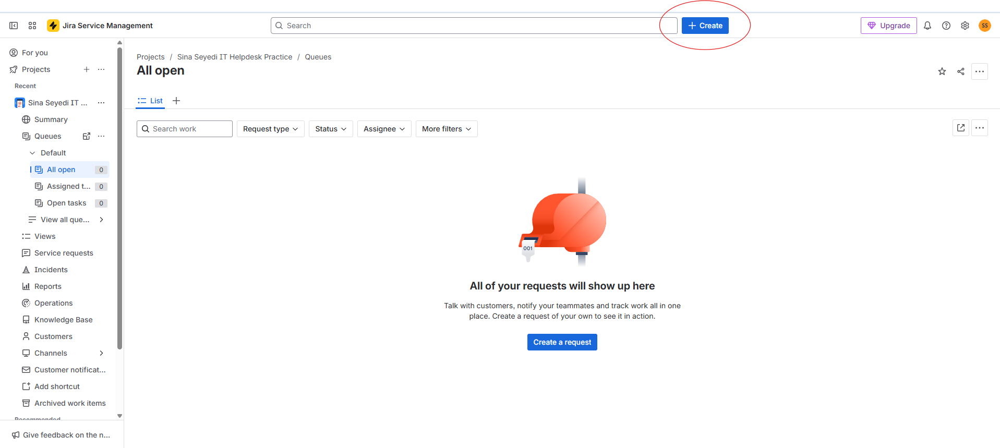
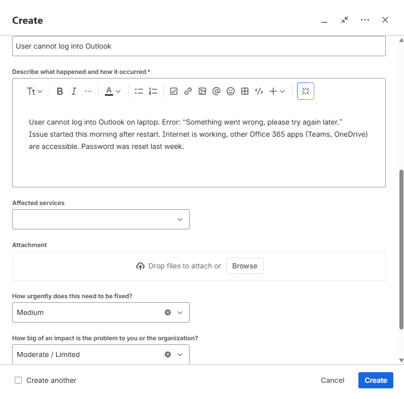
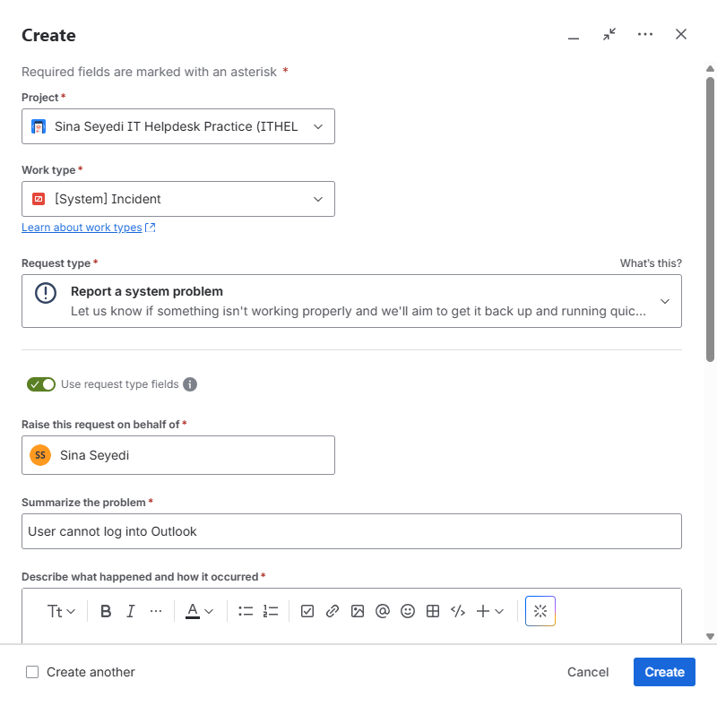
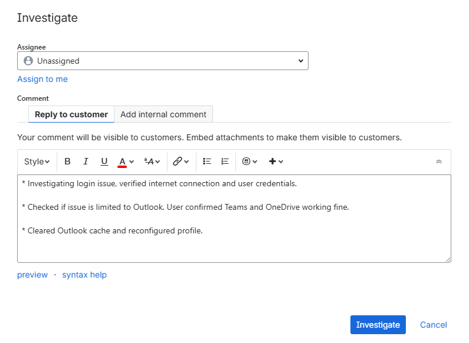
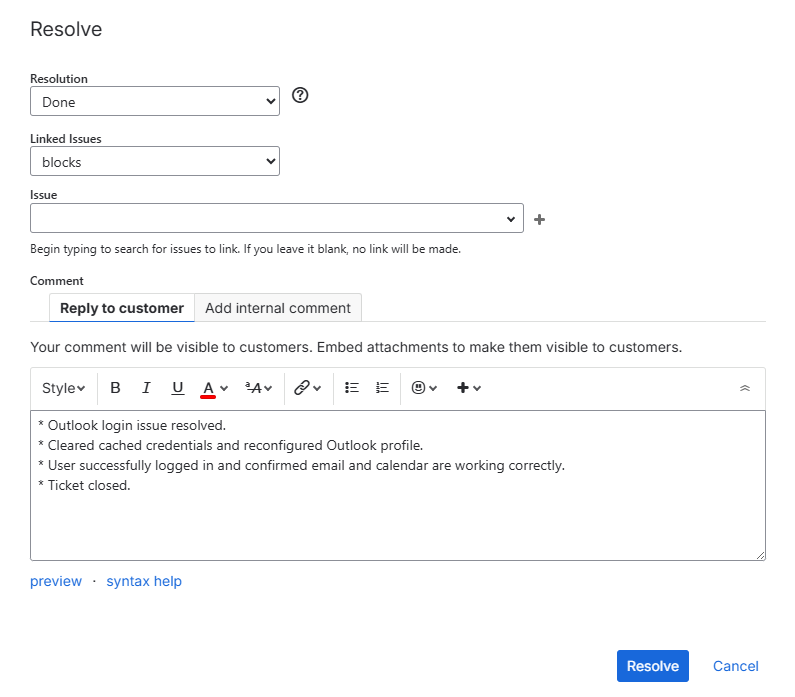

# IT Helpdesk Ticketing Portfolio

This repository demonstrates hands-on practice with IT Service Management (ITSM) processes using Jira Service Management.

The goal of this project is to simulate real-world Level 1 IT Support ticket workflows including incident logging, prioritisation, investigation, documentation, and closure.

---

## Project Structure

Jira Service Management  
Simulated incident lifecycle from ticket creation to resolution.

---

## Scenario Demonstrated

Incident: User cannot log into Outlook  
Category: Application / Microsoft 365  
Priority: Medium  
Impact: Moderate  

Workflow covered:
- Ticket creation and categorisation
- Urgency and impact assessment
- Investigation notes and troubleshooting
- Resolution documentation
- Ticket closure confirmation

---

## Skills Demonstrated

- Incident lifecycle management (Create → Investigate → Resolve → Close)
- Structured troubleshooting documentation
- Ticket prioritisation and classification
- SLA awareness
- Customer communication practices

### 1. Jira Service Management Dashboard

### 2. Incident Ticket Creation – Outlook Login Issue

### 3. Incident Classification and Prioritisation

### 4. Investigation and Troubleshooting Notes

### 5. Resolution and Ticket Closure

